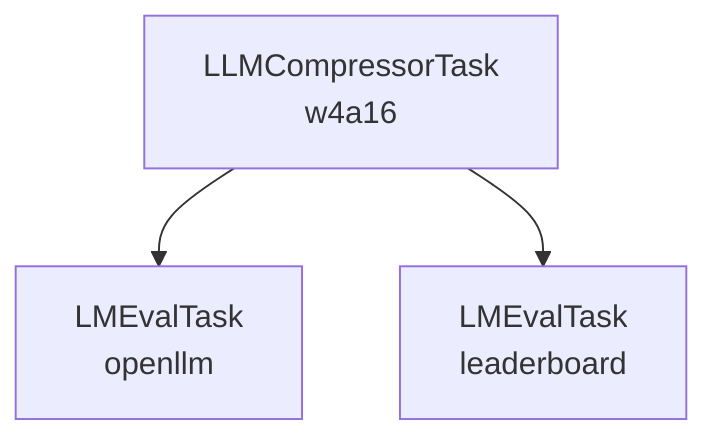

# How to Create a Pipeline

A pipeline consists of multiple tasks executed in a directed acyclic graph (DAG), ensuring dependencies are resolved before execution.
As an example, we will create a pipeline that first runs LLMCompressorTask with the quantization_w4a16 configuration. Then, the compressed model is evaluated using LMEvalTask on two benchmarks: OpenLLM and Leaderboard. The execution flow is illustrated below:



There are four main steps when creating a pipeline:
1. Create drafts of the tasks that compose the pipeline.
2. Initialize the pipeline.
3. Add the tasks as steps to the pipeline.
4. Run the pipeline


## 1. Create Drafts of the Tasks that Compose the Pipeline

```python
from automation.tasks import LLMCompressorTask, LMEvalTask

# Create LLMCompressorTask
step1 = LLMCompressorTask(
    project_name="alexandre_debug",
    task_name="step1_draft",
    model_id="meta-llama/Llama-3.2-1B-Instruct",
    config="quantization_w4a16",
)

# Create draft in ClearML backend
step1.create_task()

# Create OpenLLM eval task
# Set model_id as a placeholder, as it will be dynamically replaced with the output of step1
# Setting clearml_model=True ensures step1's output is properly linked
step2 = LMEvalTask(
    project_name="alexandre_debug",
    task_name="step2_draft",
    model_id="dummy",
    clearml_model=True,
    config="openllm",
)

# Create draft in ClearML backend
step2.create_task()

# Create Leaderboard eval task
# Set model_id as a placeholder, as it will be dynamically replaced with the output of step1
# Setting clearml_model=True ensures step1's output is properly linked
step3 = LMEvalTask(
    project_name="alexandre_debug",
    task_name="step3_draft",
    model_id="dummuy",
    clearml_model=True,
    config="leaderboard",
)

# Create draft in ClearML backend
step3.create_task()
```


## 2. Initialize the Pipeline
```python
from automation.pipelines import Pipeline

# Short and simple
pipeline = Pipeline(
    project_name="alexandre_debug",
    pipeline_name="my_pipeline",
)
```

## 3. Add Tasks as Steps to the Pipeline
```python
# Add compression step
pipeline.add_step(
    name="step1",
    base_task_id = step1.id,
    execution_queue="oneshot-a100x1",
)

# Add OpenLLM step
# Make step1 as parent to tell the pipeline it must wait for step1 to complete before starting step2
# The placeholder ${step1.models.output.-1.id} dynamically retrieves the most recent model output (-1 refers to the last generated model) from step1. This ensures that subsequent tasks always receive the correct model version.
pipeline.add_step(
    name="step2",
    base_task_id = step2.id,
    parents=["step1"],
    execution_queue="oneshot-a100x1",
    parameter_override={"Args/model_id": "${step1.models.output.-1.id}"},
)

# Add Leaderboard step
# Make step1 as parent to tell the pipeline it must wait for step1 to complete before starting step3
# Use parameter_override to point model_id to the output of step1
pipeline.add_step(
    name="step3",
    base_task_id = step3.id,
    parents=["step1"],
    execution_queue="oneshot-a100x1",
    parameter_override={"Args/model_id": "${step1.models.output.-1.id}"},
)
```

## 4. Run the Pipeline

```python
pipeline.execute_remotely()
```

- By default, pipeline execution is handled by the `services` queue, a CPU-only queue designed for orchestration rather than computation.
The actual tasks are scheduled on the specified execution queues.
- The pipeline task itself only manages the executions of the other tasks, and thus does not need GPUs.
- If one uses `pipeline.execute_locally()` the pipeline controller will run locally, while the individual tasks still execute on their designated remote queues.