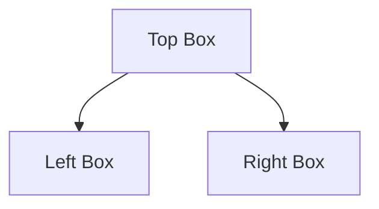

# How to Create a Pipeline

Pipelines are composed of a collection of tasks that are executed in a direct acyclic graph (DAG).
For the sake of example, let us create a pipeline that uses `LLMCompressorTask` with the `quantization_w4a16` standard, followed by evaluation of two benchmarks (OpenLLM and Leaderboard) using `LMEvalTask`, as illustrated in the schematic below.



There are four main steps when creating a pipeline:
1. Create drafts of the tasks that compose the pipeline.
2. Initialize the pipeline.
3. Add the tasks as steps to the pipeline.
4. Run the pipeline


## 1. Create Drafts of the Tasks that Compose the Pipeline

```python
from automation.tasks import LLMCompressorTask, LMEvalTask

# Create LLMCompressorTask
step1 = LLMCompressorTask(
    project_name="alexandre_debug",
    task_name="step1_draft",
    model_id="meta-llama/Llama-3.2-1B-Instruct",
    config="quantization_w4a16",
)

# Create draft in ClearML backend
step1.create_task()

# Create OpenLLM eval task
# model_id can be dummy, since it will be replaced by the output of step1
# Set clearml_model=True since the output of step1 will be a ClearML model id
step2 = LMEvalTask(
    project_name="alexandre_debug",
    task_name="step2_draft",
    model_id="dummuy",
    clearml_model=True,
    config="openllm",
)

# Create draft in ClearML backend
step2.create_task()

# Create Leaderboard eval task
# model_id can be dummy, since it will be replaced by the output of step1
# Set clearml_model=True since the output of step1 will be a ClearML model id
step3 = LMEvalTask(
    project_name="alexandre_debug",
    task_name="step3_draft",
    model_id="dummuy",
    clearml_model=True,
    config="leaderboard",
)

# Create draft in ClearML backend
step3.create_task()
```


## 2. Initialize the Pipeline
```python
from automation.pipelines import Pipeline

# Short and simple
pipeline = Pipeline(
    project_name="alexandre_debug",
    pipeline_name="my_pipeline",
)
```

## 3. Add Tasks as Steps to the Pipeline
```python
# Add compression step
pipeline.add_step(
    name="step1",
    base_task_id = step1.id,
    execution_queue="oneshot-a100x1",
)

# Add OpenLLM step
# Make step1 as parent to tell the pipeline it must wait for step1 to complete before starting step2
# Use parameter_override to point model_id to the output of step1
pipeline.add_step(
    name="step2",
    base_task_id = step2.id,
    parents=["step1"],
    execution_queue="oneshot-a100x1",
    parameter_override={"Args/model_id": "${step1.models.output.-1.id}"},
)

# Add Leaderboard step
# Make step1 as parent to tell the pipeline it must wait for step1 to complete before starting step3
# Use parameter_override to point model_id to the output of step1
pipeline.add_step(
    name="step3",
    base_task_id = step2.id,
    parents=["step1"],
    execution_queue="oneshot-a100x1",
    parameter_override={"Args/model_id": "${step1.models.output.-1.id}"},
)
```

## 4. Run the Pipeline

```python
pipeline.execute_remotely()
```

- For pipelines there is a default queue for remote execution, called `services`.
This is a CPU-only queue meant to be used for processes such as a pipeline controller, which do not need GPUs.
- The pipeline task itself only manages the executions of the other tasks, and thus does not need GPUs.
- If one uses `pipeline.execute_remotely()` the pipeline controller will run locally, but the tasks will still be submitted to the queue.